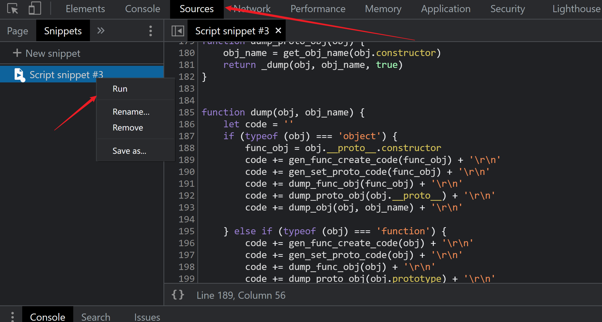
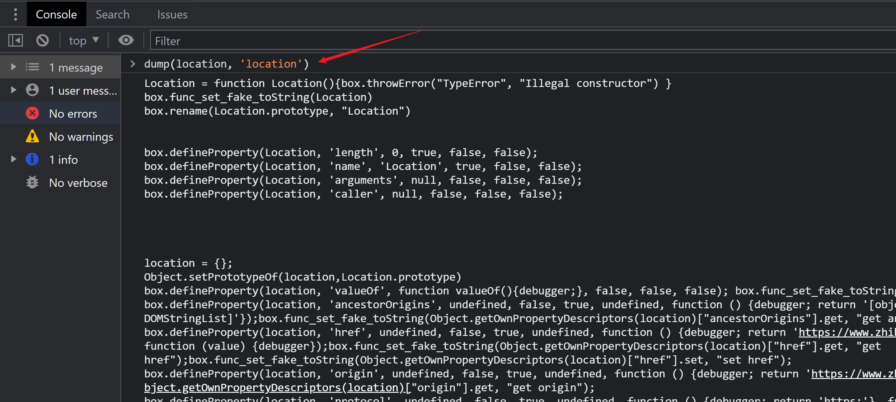
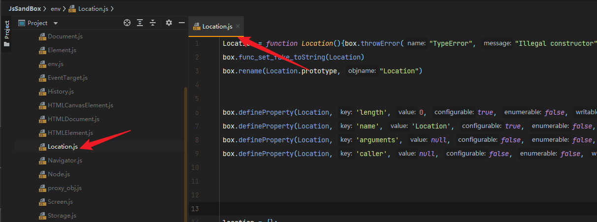
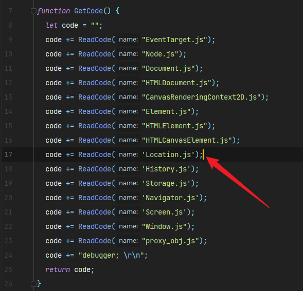
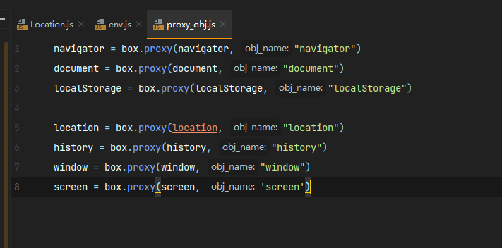

# Simple javascript sandbox for web crawler

## Motivation

Many websites use complex JavaScript protection techniques, which hinders us from developing crawlers.

We developed JsSandBox based on the idea of mimicking the browser environment, allowing you to obtain the target's complete encrypted parameters without the need for in-depth knowledge of the target site's Javascript

## Feature

- You can use tools/dump_browser_env.js to copy the browser environment with one click
- You can use tools/vm_proxy.js Hook any object
- JsSandBox has done the appropriate protection measures to bypass the common environmental monitoring logic of the site

## Basic Usage

The first step is to copy the target site's environment.

1.copy dump_browser_env.js code to Chrome sources snippet and run snippet.

2.use dump function get object environment info.

3.copy environment info to env folder.

4.modify env/env.js.

5.run main.js

## Use Proxy

Add the object you want to proxy in env/proxy_obj.js

## Thanks

- 寄予蓝y